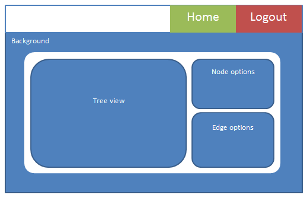

#MEAN-Decision-Tree
###Updates
#####(12/14/15) 
This application will be used for the users to help them solve small problems, such as user lockouts, password resets, basic procedures, and others. Evan Bechtol and Zhachory Volker have come up with a basic idea of how the application will be structured. They will agree on due dates and the division of labor at a later date.

	What needs to be done?
	
	1.	Division of work
	2.	Due dates
	3.	Style and design decisions
	4.	Decide how admin can edit the trees

#####(12/21/15)
The team has divided up the work according to the capabilities. Evan will be working on the admin, data structures, and back end. Zhachory will be working on the user, home, and the documentation. They will meet up again on 12/28 to see their progress.

	What needs to be done?
	
	1.	Basic template for all pages
	2.	Database setup
	3.	Hardware setup
	4.	Knowledge training (for Zhach) 

##Table of Contents
1.	[Front-End](#frontend)
	1.	[General](#general)
	1.	[Home page](#home)
	1.	[User view](#user)
	1.	[Admin view](#admin)
2.	[Back-End]()
	1.	[MEAN Stack](#mean)
	1.	[DB](#db)
	1.	[Node traversing](#node)

##Front-End 	
The front-end consists entirely of what the user sees: style, format, font, etc.

###General	
>The style of the application will be decided at a later date.

The font of the application will be Eras Light ITC for headings and subheadings and basic Arial for paragraph and other texts. The basic color for the text will be rgb(61, 61, 61) or #3d3d3d.

The format of each page will be based on a template. This template consists of three parts: the navigation bar, the background, and the content div.

The navigation bar will be at the top of the page and will house sections for login information for the admin and buttons to return to home, will be described, in detail, later.

The background will cover the entire page and reside as a “page-filler” behind the content div. The actual background image or color will be decided at a later date.

The content div will house all the information in the application. It will change depending on which page the user is looking at. It will be centered in front of the background being col-md-10 wide and leaving col-md-1 on each side. Height will depend on the height of the window, but the min-height will be 600px.

###Home page
The home page will be where every user, admin, or user will go to. Admin users will log in by pressing the top left button entitled “Admin.” Once they log in using a modal, they will return to the home page where the can edit any tree. Normal users can start using the application right away by using the content div. 

In the content div, there will be a number of buttons entitled with the names of different trees. A normal user may click on one of these that their problem is connected to and be redirected to the SPA User page that will help them through their problem. An admin user may click on one and open up their own editing panel which will let them edit the tree directly.

###User View
The user page will be where the user navigates through the tree, by panel, to help them through whatever problem they are having. 

Each panel will contain the label of that node. The label usually consists of a statement telling the user what to do, and question, which will navigate them to another node. There will also be a back button in the div that will return them to the last node they traversed.

The navigation bar will still have the admin login button (in case admins are doing debugging) and will also have a home button, which will allow them to travel all the way back to the home page.

###Admin View
The Admin page will be where the admin user can edit the tree that they selected in the home page or where the logged in from if they were already traversing a tree from the user side. The can add nodes, delete nodes, edit the labels of nodes, and arrange the nodes in different ways

	Details about how the admin user may do this will be described in detail at a later date.

##Back-End

The back-end consists of every the user does not see. This includes the database, the algorithm required to traverse the Decision Tree, and the structure of the website.

###MEAN Stack
We will be using the MEAN stack instead of LAMP or WAMP because of its flexibility and its use of JSON. It uses for applications together to make a server: 

1.	`MongoDB` – For database storage
2.	`Express.js` – Web framework for `Node.js` to quickly make web applications
3.	`Angular.js` – Helps create SPAs quickly and efficiently
4.	`Node.js` – Like Apache in Lamp, it creates the back-end for servers. Almost like a `JavaScript` compiler

`MongoDB` stores data using a flexible document data model that is similar to JSON. Documents contain one or more fields, including arrays, binary data and sub-documents. Fields can vary from document to document. 

`Express.js` is a minimal and flexible Node.js web application framework that provides a robust set of features for web and mobile applications.

The `AngularJS` library works by first reading the HTML page, which has embedded into it additional custom tag attributes. Angular interprets those attributes as directives to bind input or output parts of the page to a model that is represented by standard JavaScript variables. The values of those JavaScript variables can be manually set within the code, or retrieved from static or dynamic JSON resources.

`Node.js` is a platform built on Chrome's JavaScript runtime for easily building fast and scalable network applications. Node.js uses an event-driven, non-blocking I/O model that makes it lightweight and efficient, perfect for data-intensive real-time applications that run across distributed devices.

###Database 
The database will consist of three tables: Nodes, Edges, and Users. Since we will be hosting many trees, the Nodes and Edges tables will have an additional column called tree, to show which tree that Node or Edge belongs to.
Nodes will contain all the information 1 node will need to show the statement and question of that node. The columns are titled:

1.	Id: Each tree will start at 0
2.	Label: Step statement, and question
3.	Tree: the specific tree that this node belongs to.

Edges will contain the information of connecting one node to another and the answer to that connection. The columns are titled:

1.	From: the parent node
2.	To: the child node
3.	Label: the answer to the parent’s node label
4.	Tree: the specific tree that this node belongs to.

Users will contain basic information of the admin users and their login credentials. The columns are titled:

1.	Id: User ID
2.	Username: Login Username
3.	Password
4.	Name
5.	Email

###Node Traversing
How the application will work and traverse through the trees will be based on a hash traversal. The application will hold all the Nodes and Edges in a table and access a tree’s nodes and edges, then traverse them like a hash. The application can get the left child by taking the id of the node and multiply it by 2. To get the right child, the application will take the id of the node and multiply it by 2 and add 1.

Since some paths are longer than others and the application must have a complete tree to have a hash, the application will house null nodes to put in place of some spots to keep the tree complete. 
